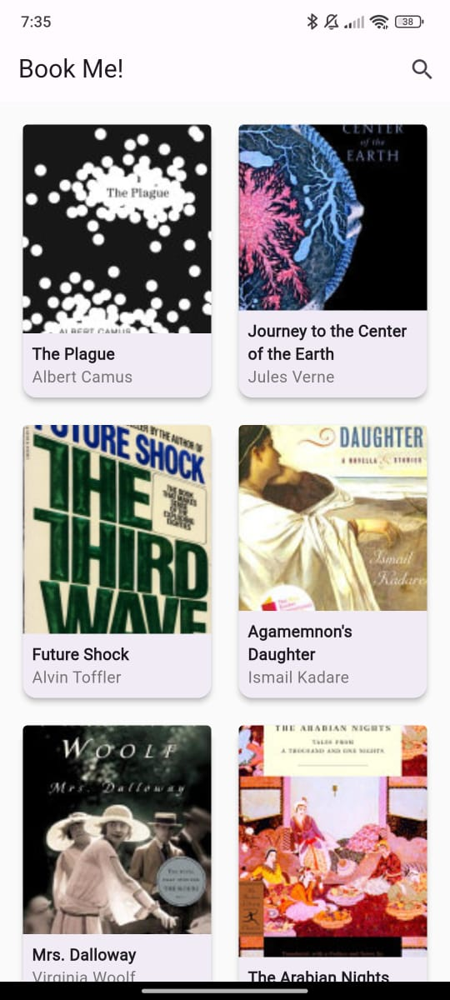

# **BookApp**

BookApp is a Flutter-based application that fetches and displays books using the Google Books API. Users can view book details, including thumbnails, descriptions.

---

## **Features**

- Search for books by query or browse popular categories.
- View detailed book information, including:
  - Title and authors
  - Description
  - Language, page count, and publication date
  - Book cover thumbnail

---

## **Tech Stack**

- **Frontend**: Flutter (Dart)
- **Backend/API**: Google Books API
- **State Management**: BLoC (Business Logic Component)
- **HTTP Client**: Dio for making API calls

---

## **Project Structure**

```plaintext
lib/
├── models/
│   └── book.dart          # Data model for book information
├── services/
│   └── book_service.dart  # API service to fetch book data
├── blocs/
│   └── book_bloc.dart     # Bloc for handling book data and state
├── screens/
│   ├── book_detail_page.dart # UI for detailed book view
│   └── home_page.dart        # UI for listing and searching books
├── widgets/
│   └── book_card.dart   # Book card widgets
└── main.dart               # App entry point
```

## Screenshots

### Home Page



### Book Details Page


